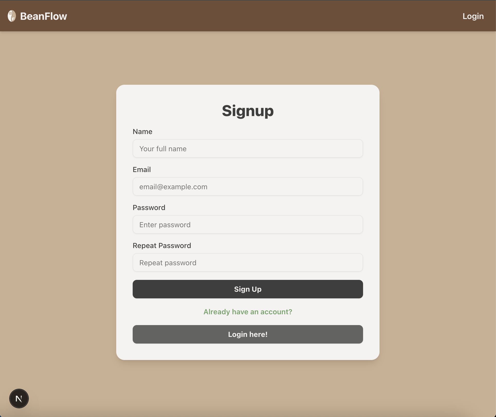
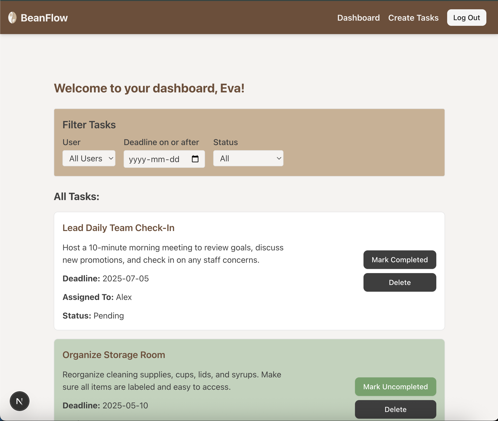
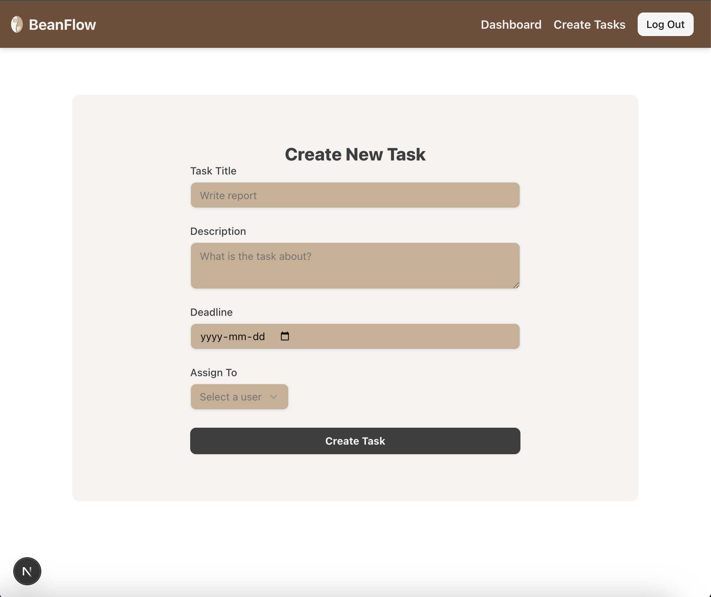

# BeanFlow Task Manager App
A role-based task management application built with **Next.js**, **Firebase**, **Tailwind CSS** and **Shadcn**.
It supports authentication, user roles (admin & user), task assignment and status tracking. Admins can assign tasks to users, while users can view and complete their own tasks.

---

## Features

- Authentication (Firebase Auth)
- Role-based Access Control (Admin & User)
- Task Management (Create, assign, complete, delete, filter, paginate)
- Tailwind CSS styling
- Firestore for real-time database
- Unit Testing with Jest

